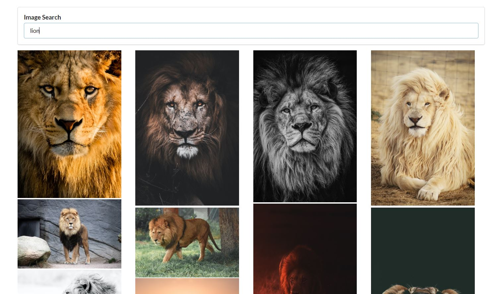

## Image Finder App

This project consists in a basic image search application, the user enters a search term and makes a request to the unsplash.com api service and a list of images related to the search term are displayed.

## Built With

- ReactJS
- HTML / Semantic CSS

## App Screenshots



## Setup instructions

Open a terminal window, go to the location you'd like to add the project and then run the commands below.

```console
git clone https://github.com/noomdalv/react_pics.git
```

```console
cd react_pics
```

```console
npm install
```

```console
npm start
```

## Author

👤 **Vladimir Luna**

- Github: [@noomdalv](https://github.com/noomdalv)


## 📝 License

This project is [MIT](lic.url) licensed.
